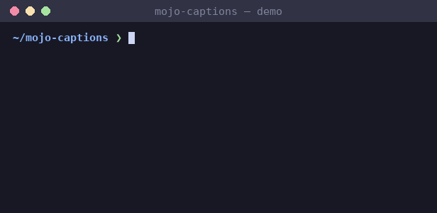

<div align="center">

# mojo-captions

**SRT and WebVTT subtitle/transcript parsing in pure Mojo. No Python dependencies, no FFI.**

[](LICENSE)
[](https://mojolang.org)
[](https://chainofthought.show)
[](https://x.com/ConorBronsdon)



</div>

As of mid-2026 the Mojo ecosystem has no library for reading subtitle or
transcript files. mojo-captions fills that gap: a liberal SRT/WebVTT parser,
two serializers, and a handful of transcript utilities. I built it to work
with Chain of Thought's own episode transcripts: pulling quotes for show
notes, picking the timestamp window for a clip, and turning an SRT or VTT
export into a clean transcript.

## What it handles

- **Auto-detection**: a leading `WEBVTT` header means WebVTT, anything else
  parses as SubRip.
- **Timestamps**: SRT comma (`00:01:02,345`) and VTT dot (`00:01:02.345`)
  millisecond separators, with optional hours, accepted in either format.
- **Speakers**: WebVTT voice spans (`<v Name>text</v>`, including
  `<v.class Name>` annotations) and the plain `Speaker Name: text`
  convention on a cue's first line, guarded to a 48-byte prefix so it
  doesn't eat markup or an ordinary sentence's colon.
- **WebVTT extras**: NOTE, STYLE, and REGION blocks skipped entirely; cue
  settings after the timing arrow (`position:`, `align:`, ...) dropped;
  numeric cue identifiers preserved, non-numeric ones replaced by document
  position.
- **CRLF and LF line endings, and a UTF-8 BOM** on either format.
- **Liberal parsing**: a cue block with no timing line or an unparseable
  timestamp is skipped, never fatal. An empty document just returns zero
  cues.
- **Glued-cue recovery**: two cues packed together with no blank-line
  separator are still split correctly instead of the first cue swallowing
  the second's index, timing, and text.
- **Round-trip serialization**: `to_srt` and `to_vtt` reconstruct a document
  from `Captions`, with a representability guard: a speaker too long for
  the `Name: ` prefix, or containing `:`, `<`, or `>`, is left out of the
  SRT text (kept on the in-memory `Cue`) rather than risk an unparseable
  or corrupted re-parse.
- **Transcript utilities**: `plain_text` for a timestamp-free transcript,
  `cues_between` for the cues overlapping a time window, `duration_ms` for
  the document's total length.

## What it deliberately does NOT do

- **Style inline markup beyond voice spans.** `<b>`, `<i>`, karaoke timing
  tags, and similar are left verbatim in cue text in v0.1.
- **Normalize encodings.** UTF-16 and Latin-1 documents aren't transcoded
  yet; pass UTF-8 text in.
- **Model VTT positioning.** Cue settings (`position:`, `line:`, `align:`,
  ...) are dropped during parsing rather than represented as data.

## Install

With [pixi](https://pixi.prefix.dev):

```bash
pixi install
pixi run test
```

Or with uv:

```bash
uv venv
uv pip install mojo --index https://whl.modular.com/nightly/simple/ --prerelease allow
.venv/bin/mojo run -I src test/test_captions.mojo
```

Requires a Mojo nightly (`>=1.0.0b3`).

## Usage

```mojo
from captions import parse_captions, cues_between, plain_text

def main() raises:
    var caps = parse_captions(open("episode.srt", "r").read())
    print(caps)                             # Captions(srt, 512 cues)

    for cue in caps.cues:
        print(cue.start_ms, cue.speaker, cue.text)

    # Cues covering the second minute of the episode, for a clip:
    var clip = cues_between(caps, 60_000, 120_000)
    print(len(clip))

    print(plain_text(caps))                 # transcript, no timestamps
```

`Cue` fields: `index`, `start_ms`, `end_ms`, `speaker`, `text`. Empty
string means the field was absent, mirroring mojo-feed's model conventions.

## Tests

```bash
pixi run test
```

29 tests cover format detection, both timestamp separators, voice-span and
colon-convention speaker extraction, NOTE/STYLE/REGION handling, cue
settings, CRLF/BOM, glued cues, and round-trip serialization through both
fixture and hand-built documents. Fuzz-tested (`test/fuzz_runner.mojo`)
against 1,300+ mutated documents (byte flips, truncations, and structural
splices) with zero crashes and zero hangs: malformed input either parses
liberally or is skipped, never fatal.

## Part of a pure-Mojo library suite

Nine pure-Mojo libraries that mirror familiar Python stdlib and PyPI APIs,
filling gaps in the native Mojo ecosystem:

- [mojo-feed](https://github.com/conorbronsdon/mojo-feed) — RSS, Atom, and
  JSON Feed parsing (Python's `feedparser`)
- [mojo-html](https://github.com/conorbronsdon/mojo-html) — HTML parsing and
  article extraction (Python's readability)
- [mojo-markdown](https://github.com/conorbronsdon/mojo-markdown) —
  CommonMark markdown parsing (Python's `markdown`)
- [mojo-unicodedata](https://github.com/conorbronsdon/mojo-unicodedata) —
  Unicode normalization and case folding (Python's `unicodedata`)
- [mojo-diff](https://github.com/conorbronsdon/mojo-diff) — text diffing
  (Python's `difflib`)
- [mojo-template](https://github.com/conorbronsdon/mojo-template) — a
  Jinja-flavored template engine (Python's `jinja2`)
- [mojo-tar](https://github.com/conorbronsdon/mojo-tar) — tar archive
  reading and writing (Python's `tarfile`)
- [mojo-redis](https://github.com/conorbronsdon/mojo-redis) — a Redis
  client (Python's `redis-py`)

## Contributing

Issues and PRs welcome, especially real-world caption files that parse
wrong (attach the file or a snippet) and edge cases in the speaker
conventions. Run `pixi run test` before sending a PR.

## About

Built by [Conor Bronsdon](https://conorbronsdon.com) — host of
[Chain of Thought](https://chainofthought.show), a podcast about AI agents,
infrastructure, and engineering. This library exists to parse that show's
own episode transcripts. Find me on [X](https://x.com/ConorBronsdon) or
[LinkedIn](https://www.linkedin.com/in/conorbronsdon).


---

## Disclaimer

*All views, opinions, and statements expressed on this account/in this repo are solely my own and are made in my personal capacity. They do not reflect, and should not be construed as reflecting, the views, positions, or policies of Modular. This account is not affiliated with, authorized by, or endorsed by my employer in any way.*

## License

Licensed under the [MIT License](LICENSE).
